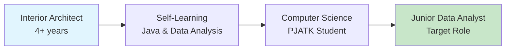

# Hi there, I'm Bartłomiej Miłosz 👋

## 🎯 About Me
**Interior Architect transitioning to Data Analytics** | Warsaw, Poland

I'm combining **4+ years of systematic problem-solving** from architecture with growing technical expertise in data analytics. Currently studying Computer Science at PJATK and building my analytical toolkit.

- 🏗️ **Background:** Interior Architecture & Client Consulting
- 📊 **Transitioning to:** Data Analytics & Business Intelligence  
- 🎓 **Currently studying:** Computer Science at PJATK Warsaw
- 🌱 **Learning:** Python, SQL, Excel Advanced, Business Intelligence
- 📍 **Location:** Warsaw, Poland
- 💼 **Looking for:** Junior Data Analyst opportunities

## 🛠️ Technical Skills

### Data Analysis & Programming

### Development Experience

### Tools & Technologies

## 📊 GitHub Stats

## 🚀 Featured Projects

### [📊 Student Enrollment System](https://github.com/bartlomiejMilosz/student-enrollment-app)
Java Spring Boot application with PostgreSQL database, featuring RESTful API and comprehensive testing.
- **Tech:** Java, Spring Boot, PostgreSQL, Docker
- **Features:** CRUD operations, data validation, REST API

### [🎬 Movie Rental System](https://github.com/bartlomiejMilosz/movie-rental-system)
Node.js application demonstrating full-stack development with MongoDB integration.
- **Tech:** Node.js, Express.js, MongoDB, JWT
- **Features:** User authentication, rental management, API design

### [🌐 Personal Portfolio](https://github.com/bartlomiejMilosz/bartlomiej-milosz.github.io)
Modern portfolio website built with Astro.js, showcasing my transition journey and projects.
- **Tech:** Astro.js, Tailwind CSS, TypeScript
- **Features:** Dark/light mode, responsive design, SEO optimized

## 📈 Career Transition Journey

**From Architecture to Analytics:**
- ✅ **Systematic Problem-Solving** - Honed through complex architectural projects
- ✅ **Stakeholder Communication** - 4+ years of client consulting experience  
- ✅ **Project Coordination** - Managing timelines, budgets, and deliverables
- ✅ **Analytical Thinking** - Spatial analysis and design optimization
- 🌱 **Technical Skills** - Growing expertise in Python, SQL, and BI tools

## 🎓 Education & Certifications

- 🎓 **Computer Science** - PJATK Warsaw (2024-Present)
- 🎓 **Master of Architecture** - Rzeszów University of Technology (2016-2021)
- 📊 **Maven Analytics** - Data Analysis Certification (In Progress)

## 📫 Let's Connect!

---

> *"Bridging the analytical precision of architecture with the insights of data analytics"*

⭐ **Fun fact:** I believe that designing buildings and analyzing data share the same core principle - understanding patterns, solving problems systematically, and creating solutions that serve people's needs!

